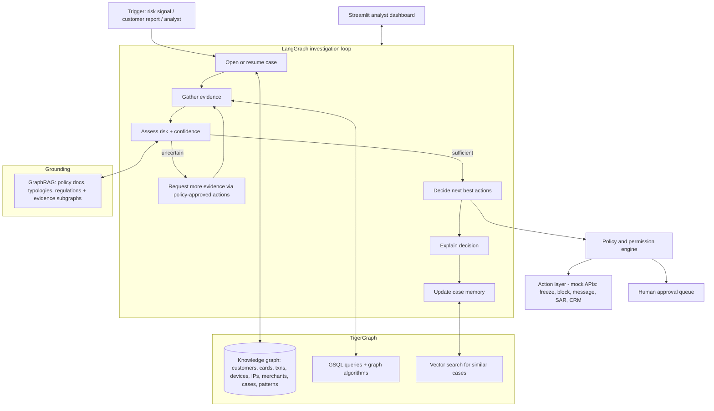

# TigerGraph Agentic Fraud Investigation Agent

An AI agent that investigates card fraud end to end: it picks up a fraud signal,
opens a case, pulls connected evidence out of a TigerGraph knowledge graph,
scores its own confidence, asks for more evidence when it is unsure, recommends
(or executes) the next best action within a strict policy/permission model, and
writes the whole investigation back into the graph so future cases get smarter.

Built for the **TigerGraph Agentic Fraud Investigation Hackathon (HHGOA)**.

---

## Why this design

Fraud signals are rarely black and white. A 0.93 risk score with a brand new
device is a very different situation from a 0.93 score on a customer's usual
phone at their usual merchant. So the heart of this agent is not a classifier,
it is an **uncertainty-aware investigation loop**: the agent keeps gathering
evidence until it can defend an action, and it records its recommended next
best action *before* and *after* every evidence request, exactly as the
benchmark requires.

## Architecture



### Key components

| Layer | Where | What it does |
|---|---|---|
| Graph schema + loaders | `gsql/schema.gsql`, `gsql/load.gsql` | Models customers, cards, transactions, devices, IPs, merchants, fraud cases, patterns |
| Investigation queries | `gsql/queries.gsql` | Multi-hop evidence subgraphs, shared-attribute ring detection, velocity checks, pattern matches, similar-case search |
| Graph client | `agent/graph_client.py` | pyTigerGraph wrapper + **offline mode** that answers the same queries from the sample CSVs so everything runs without a live cluster |
| TigerGraph MCP | `agent/tools.py` | Graph capabilities exposed to the agent as tools (works with [tigergraph-mcp](https://github.com/tigergraph/tigergraph-mcp)) |
| Policy engine | `agent/policy_engine.py` | Action catalog with permission tiers: auto-executable, human-approval, recommend-only |
| Uncertainty model | `agent/uncertainty.py` | Confidence scoring + evidence-sufficiency gate that drives the loop |
| Case manager | `agent/case_manager.py` | Case lifecycle, audit trail, write-back to the graph |
| Case memory | `agent/memory.py` | Stores outcomes, retrieves similar prior cases, surfaces recurring entities |
| GraphRAG | `agent/graphrag.py` | Grounds the LLM with policy/typology text + connected evidence, never raw dumps |
| Agent workflow | `agent/investigator.py` | LangGraph state machine implementing the full loop |
| Actions | `agent/actions.py` | Simulated customer messages, freezes, card blocks, SAR filing, CRM updates |
| Benchmark runner | `benchmark/run_benchmark.py` | Produces one answer file per benchmark case, NBA recorded before/after evidence |
| Dashboard | `ui/dashboard.py` | Case list, timeline, evidence graph, risk/confidence gauges, approval queue |

## Quick start

```bash
git clone https://gitlab.com/hgoaa-group/tigergraph.git && cd tigergraph
python -m venv .venv && source .venv/bin/activate
pip install -r requirements.txt
cp .env.example .env        # add your LLM key; leave OFFLINE_MODE=true for a no-cluster demo

# Run the case pack (uses data/sample out of the box; point DATA_DIR at the
# extracted HHGOA_IEEE folder for the official 20 cases). Answer files land in ./cases
python -m benchmark.run_benchmark

# Launch the analyst dashboard
streamlit run ui/dashboard.py

# Run tests
pytest
```

## Using a real TigerGraph instance (Savanna or Community Edition)

1. Create a workspace on [Savanna](https://savanna.tgcloud.io) (enable auto-stop/auto-start) or install [Community Edition](https://dl.tigergraph.com).
2. Fill in `TG_HOST`, `TG_GRAPH`, credentials in `.env` and set `OFFLINE_MODE=false`.
3. Create schema, loaders and queries:
   ```bash
   gsql gsql/schema.gsql
   gsql gsql/load.gsql
   gsql gsql/queries.gsql
   ```
4. Load the HHGOA_IEEE CSVs with the `load_transactions`, `load_identity` and `load_prior_cases` jobs.
5. Optionally run the agent through [tigergraph-mcp](https://github.com/tigergraph/tigergraph-mcp) - the tool layer speaks the same query names.

## Repository layout

```
gsql/         Graph schema, loading jobs, installed queries
agent/        The investigation agent and all supporting modules
benchmark/    Benchmark case runner + answer file writer
ui/           Streamlit analyst dashboard
data/sample/  Synthetic dataset + fraud policy for testing
tests/        Unit tests for policy engine, uncertainty model, case lifecycle
cases/        Official 20 benchmark case answer files (HHG-001.json - HHG-020.json)
```

## Judging criteria mapping

- **Investigation accuracy** - graph-native evidence: multi-hop subgraphs, ring detection, velocity, typology pattern queries.
- **Next best action** - explicit confidence model; NBA + approval route recorded before *and* after each evidence request.
- **Explainability** - every case carries a structured reasoning record: evidence used, uncertainty remaining, why each action.
- **Agentic design** - LangGraph orchestration, tool use via MCP-compatible layer, memory, policy/permission controls.
- **Innovation** - GraphRAG that fuses policy text with live evidence subgraphs; case memory stored *in the graph*.
